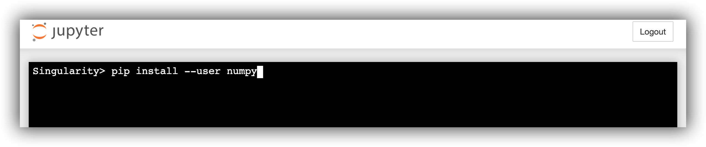

# What is FAS OnDemand? {-}

[FAS OnDemand](https://atg.fas.harvard.edu/ondemand) gives Harvard students access to Jupyter Notebooks and RStudio, and can be launched directly from [Canvas](https://canvas.harvard.edu/). It is hosted by Harvard’s FAS Research Computing group (FAS RC) and collaboratively supported by both FAS RC and FAS Academic Technology.

## Why are we using FAS OnDemand for DataFest? {-}

It can sometimes be challenging in large courses to get every student's personal computer set-up with the necessary software. For this DataFest bootcamp, you will need an up to date R or Python environment with a suite of non-default packages/modules installed. FAS OnDemand provides you access to an environment that has been curated specifically for DataFest2021, so you can focus on learning skills, rather than debugging your software installation. In addition, you can access FAS OnDemand directly from within the DataFest2021 course on Canvas.

When using the FAS OnDemand environment, you will have access to resources that include:

- 8 cores
- 16Gb RAM
- 20Gb storage
- 10Tb scratch storage (shared between all users on the course)

Of course, if you prefer to use your own local R or Python environment on your personal computer that is perfectly fine, but we will not be able to provide assistance to you if you encounter problems setting that up correctly. 

The FAS OnDemand DataFest2021 Jupyter Notebooks installation comes with a `Python 3` jupyter kernel, common data science packages such as `numpy`, `scipy`, `seaborn`, `pandas`, `bokeh`, and `matplotlib`, as well as many specialized modules we'll use during DataFest. 

The FAS OnDemand DataFest2021 RStudio installation is available for `R 4.0.3` and comes preinstalled with common packages such as `devtools`, `learnr`, and the complete `tidyverse` collection of R packages, as well as many specialized packages we'll use during DataFest. 

# Launch RStudio / Jupyter {-}

To be able to use the FAS OnDemand computing environment for your DataFest project you will need to walk-through a handful of steps. Once completed, you will be running an RStudio or Jupyter session with all necessary packages pre-installed. The FAS OnDemand computing environment is accessed from *within* Canvas --- look for the `FAS OnDemand` button on the left-side navigation panel. Here are the steps to launch your session:

1. Click `FAS OnDemand` in the left-side navigation panel within Canvas.

## RStudio

2. On the Dashboard launcher page, on the left-side panel, click on `Rstudio Server - DataFest2021`.
3. On the main panel, click the blue `Launch` button.

4. On the Sessions page, click on the blue `Connect to RStudio Server` button. 

5. You should now have access to RStudio. You can create a new R/Rmarkdown file as usual, or open an existing file.

## Jupyter

2. On the Dashboard launcher page, on the left-side panel, click on `Jupyter Notebook - DataFest2021`.
3. On the main panel, click the blue `Launch` button.

4. On the Sessions page, click on the blue `Connect to Jupyter` button. 

5. You should now have access to Jupyter. You can either create a new notebook from the `New` dropdown on the far right (select the `datafest_2021` kernel) or you can navigate to an existing file (after opening the file, select the `datafest_2021` kernel from the Kernal menu).

# Install packages in RStudio / Jupyter {-}

It is probable that the package you need is already pre-installed and that you can load it into your R/Python session in the usual way. If that is not the case, below are the steps to install R and Python packages.

## RStudio

You can install from CRAN or Github using the `Console` as follows: 

1. CRAN: `install.packages("packagename")`
2. Github: `remotes::install_github("user/packagename")`

For example, to install the `shiny` package, run `install.packages("shiny")`:

## Jupyter

1. From the jupyter notebooks interface, click `New` then `Terminal`. A terminal will open in a new browser tab.

2. In the Terminal, run `pip install --user packagename`, replacing `packagename` with the Python package you intend to install. e.g:

# Copy instructor's code/data to your home directory

If your instructor has uploaded code and/or data to the shared drive (this is the `shared_data` directory within your `Home` directory) then the first thing you should do before using these files is to copy them to your `Home` directory. These copies will serve as your own personal version of the files, which you can modify as you wish.

There are several different ways you can copy files from the `shared_data` directory to your `Home` directory, depending on whether you'd prefer to use the command line or a GUI. Here are the options:

## RStudio

### Using Terminal

1. Click on the `Terminal` tab on the top left panel, next to `Console`.
2. Copy the file(s) or directories you want from the "shared_data" directory to your home directory: `cp -r shared_data/<directory-you-want>/ .`

### Using shell commands in the R console

1. Copy the file(s) or directories you want from the `shared_data` directory to your home directory by running the following command in the console: `system("cp -r ~/shared_data/<directory-you-want>/ .")`

### Using the File menu

1. In the `Files` menu in the bottom right panel, navigate to the `shared_data` directory.
2. Navigate to the directory with materials for the current session.
3. Put a check next to the file you want to copy to your home folder. You can only copy one file at a time and no directories.
4. Click on the `More` dropdown menu (with gears icon) and select `Copy To`.
5. Near the top of the resulting pop-up window, click on the `Home` directory icon.
6. Click the `Save` button on the bottom right. There will now be a copy of the file in your home directory, which you can open and work with.

## Jupyter

### Using Terminal

1. Click on the `New` dropdown on the right side of the page.
2. Select `Terminal` from the dropdown menu.
3. In the new browser tab, copy the file(s) or directories you want from the `shared_data` directory to your home directory: `cp -r shared_data/<directory-you-want>/ .`
4. Close the browser tab containing the Terminal (don’t click `logout`!). Go back to the previous browser tab to access Jupyter again.

### Using shell commands in cells

1. Open a Jupyter Notebook or create a new cell.
2. Copy the file(s) of interest to your home directory: `!cp -r ~/shared_data/<directory-you-want>/ .`

### Using the File menu

1. Navigate to the file of interest within the `shared_data` directory.
2. Click `Duplicate` from the top menu.
3. Select the radio button next to the duplicated file.
4. Click `Move` from the top menu.
5. Delete ALL of the file path in the pop-up window and click the blue `Move` button 

# Download code/data to your personal computer

At the end of your project, you will probably want to download your script files and data files from the FAS OnDemand environment to your local machine. This is easy to do from within RStudio / Jupyter:

## RStudio

1. Select the file of interest using the radio button within the file browser (bottom right panel).
2. Click on the `More` dropdown menu (with gears icon) and select `Export`.
3. In the pop-up window, click `Download`.

## Jupyter

1. Select the file of interest using the radio button within the file browser.
2. Click the `Download` button on the top menu.

# Upload code/data to your home directory

If you have files on your personal computer that you'd like to use within the FAS OnDemand computing environment, you can upload them by following these steps (the steps are the same regardless of whether you intend to use RStudio or Jupyter):

1. Click `FAS OnDemand` in the left-side navigation panel within Canvas.
2. On the Dashboard launcher page, go to the `Files` dropdown menu at top-left and click on `Home Directory`.
3. Within the File Explorer page, you can upload whatever files you like to your home directory on FAS OnDemand by clicking on the `Upload` button at the very top right of the page and then choosing a file from your local machine.

